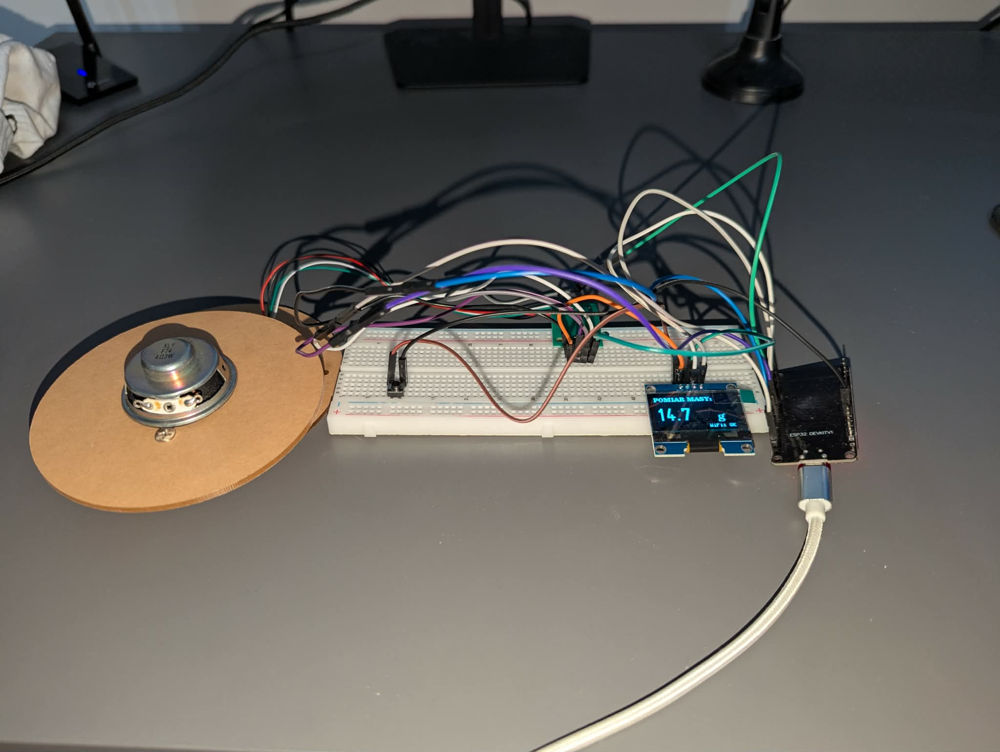

# Projekt wagi elektronicznej (Arduino)

Projekt budowy i oprogramowania wagi elektronicznej z wykorzystaniem mikrokontrolera i czujnika tensometrycznego.

### Szczegóły techniczne:
* **Hardware:** Arduino (Atmega328P), belka tensometryczna (Load Cell), moduł HX711, wyświetlacz LCD I2C.
* **Oprogramowanie:** Kod napisany w C++ (Arduino IDE).
* **Funkcje:** Kalibracja czujnika, funkcja tarowania (zerowania) oraz stabilizacja odczytu w czasie rzeczywistym.

### Zdjęcie układu:

